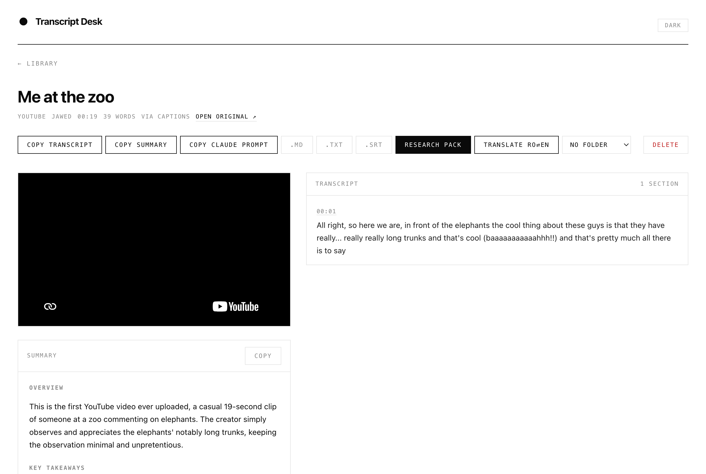
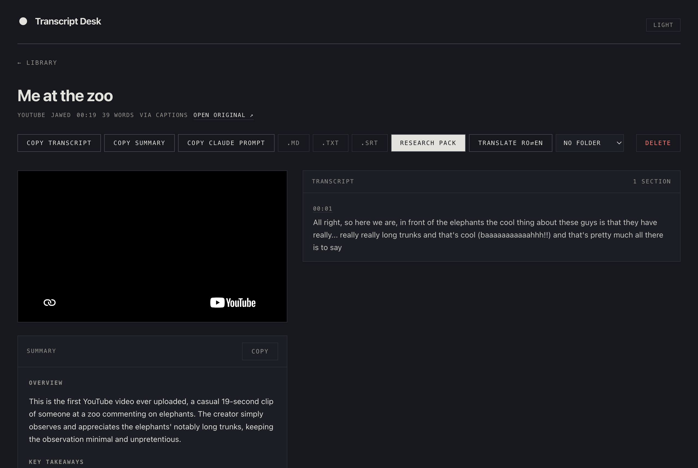

# Transcript Desk

A local research desk for the internet. Paste a YouTube, TikTok, or Instagram
link, a tweet, or an article URL — or drop in video, audio, or a screenshot —
and get clean text (timestamped transcript, tweet + OCR'd images, or extracted
article), an AI summary with chapters, and a research pack (claims table,
fact/opinion split, verification queries), organized in a searchable library
that also lives as plain Markdown on your disk.

Everything runs on your own Mac. Transcription is local (Whisper on Apple
Silicon), fetching is local (yt-dlp), storage is plain files. The AI layer
runs through the [Claude Code](https://claude.com/claude-code) CLI on the
Claude subscription you already have — **no API keys anywhere**.

<p>
  
  
</p>

## Why this exists

Free transcript sites are a dime a dozen. What they don't do: keep a library,
run privately, work on TikToks and reels, or take the transcript seriously as
*research material*. Transcript Desk's reason to exist is the layer after
transcription — persistent research packs with timestamped claims you can
trace back to the second they were said, folders that mirror your projects,
full-text search across everything you've ever transcribed, and a Markdown
archive that outlives the app.

## What it does

- **Paste a link** (YouTube, TikTok, Instagram, podcasts — anything yt-dlp
  speaks) or **drop files** anywhere on the window, several at once
- **Captions-first**: if the platform has captions, the transcript is instant;
  otherwise audio is fetched and transcribed locally with Whisper
  (`large-v3-turbo` via mlx-whisper — free, private, multilingual)
- **AI summary** with timestamped key takeaways, **chapter titles** on long
  content, **translation** (Romanian ⇄ English by default — one prompt to
  change), and an on-demand **research pack**: claims table, exact quotes,
  fact/opinion/speculation split, suggested verification queries
- **Playlists**: paste a playlist link, every video becomes its own note,
  processed one at a time
- **Tweets**: text, images (read via Apple's Vision OCR — local and free),
  and quoted tweets captured; video tweets get the full transcript pipeline;
  link-only tweets capture whatever they point at
- **Articles**: readability extraction to Markdown (Defuddle), with a
  headless-Chrome fallback for script-rendered pages
- **Screenshots**: drop any image — the text is read out of it
- **Reading list**: a separate section for books — add by title and the
  author, description, and tags fill themselves in; copy or export as
  Markdown
- **Library**: folders, full-text search with timestamped snippets, real
  thumbnails (uploaded videos get a frame grab, audio gets a waveform tile)
- **Markdown mirror**: every note is also a formatted `.md` in
  `~/Documents/Transcripts/` — YAML frontmatter, folders mirrored as
  subfolders, deletions archived to `_history/`, readable in Obsidian
- **Exports**: `.md` / `.txt` / `.srt`, copy buttons, and a one-tap
  "Copy Claude prompt" for taking a transcript into a chat for deeper work
- **Phone**: open the same app from your phone's browser and Add to Home
  Screen — the phone is a live window into your Mac's library, so there's
  nothing to sync. Pair with [Tailscale](https://tailscale.com) and it works
  away from home too, without exposing anything to the internet.
- Light and dark theme (follows the system, manual override, `?theme=` URLs)

## Requirements

- A Mac with **Apple Silicon** (transcription uses mlx-whisper)
- [Homebrew](https://brew.sh): `brew install yt-dlp ffmpeg`
- Python 3: `pip3 install mlx-whisper` (the Whisper model, ~1.6 GB, downloads
  on first use)
- Node.js 20+
- Optional, for the AI features: the [Claude Code
  CLI](https://claude.com/claude-code), logged in (`claude` → `/login`).
  Without it, transcription, library, search, and exports all work — the AI
  buttons will tell you what's missing.
- Optional: Apple's Command Line Tools (`xcode-select --install`) build the
  OCR helper and the native app; Google Chrome, if present, rescues
  script-rendered articles.

## Install

```bash
git clone https://github.com/cvdvs/transcript-desk
cd transcript-desk
./Scripts/install-service.sh
```

That builds the app and installs it as a login service — it's now running at
**http://localhost:3999**, starts with your Mac, and restarts itself if it
crashes.

Want it as a real Mac app — Dock icon, own window, no browser?

```bash
./Scripts/build-app.sh
```

Then find **Transcript Desk** in Spotlight. The app checks the service and
revives it if needed, so it always opens to a working screen.

On your phone (same Wi-Fi): `http://<your-mac>.local:3999` → share →
**Add to Home Screen**.

## What it costs to run

Nothing. Fetching and transcription are local and free. The AI summaries,
chapters, translation, and research packs run on whatever Claude subscription
you already pay for — summaries use the small fast model and are negligible;
research packs use a bigger model and are still only a few percent of a usage
window for an hour-long video.

## Honest limits

- **Apple Silicon Macs only** as shipped (mlx-whisper). The pipeline is one
  file — swapping in another Whisper backend is a contained change.
- **yt-dlp vs. the platforms** is an eternal arms race — when a site changes,
  `brew upgrade yt-dlp` usually fixes it.
- **Instagram** sometimes requires login cookies for fetching; thumbnails
  from Instagram expire after a while (cards fall back to a generated tile).
- **No login/auth** — the app trusts its network. Keep it on localhost, your
  home network, or a tailnet. Don't port-forward it to the internet.
- Translation defaults to Romanian ⇄ English (the author is Romanian) —
  `translatePrompt` in `lib/prompts.js` is the one thing to edit.

## How it's built

Next.js (App Router, plain JS, no database — notes are JSON files), a
pipeline that shells out to `yt-dlp` / `mlx_whisper` / `claude`
(`lib/pipeline.js`), and a ~200-line Objective-C + WKWebView native shell
(`native/main.m`) instead of Electron. Whisper runs are serialized machine-wide
with a lock; a heartbeat protocol keeps a dev server and the service from
stepping on each other's notes; mirror files carry their note's id so two
same-titled notes can never overwrite each other.

### For AI coding agents

`lib/` is the engine: `pipeline.js` (fetch → transcribe → summarize),
`store.js` (file-backed notes + maintenance sweep), `mdsync.js` (the
Markdown mirror — ownership-checked, never deletes). Dev server:
`npm run dev` on port 4999 (never fights the service on 3999). After code
changes: `npm run build`, then reload the LaunchAgent. The transcription
queue, heartbeats (`data/.hb/`), and the whisper lock (`data/.whisper.lock`)
are cross-process safety — don't remove them.

---

Made by [Claudia Vaduvescu](https://goodglyph.com) (GOODGLYPH) for her own
research workflow, and shared as-is. Built with
[Claude Code](https://claude.com/claude-code). MIT.
